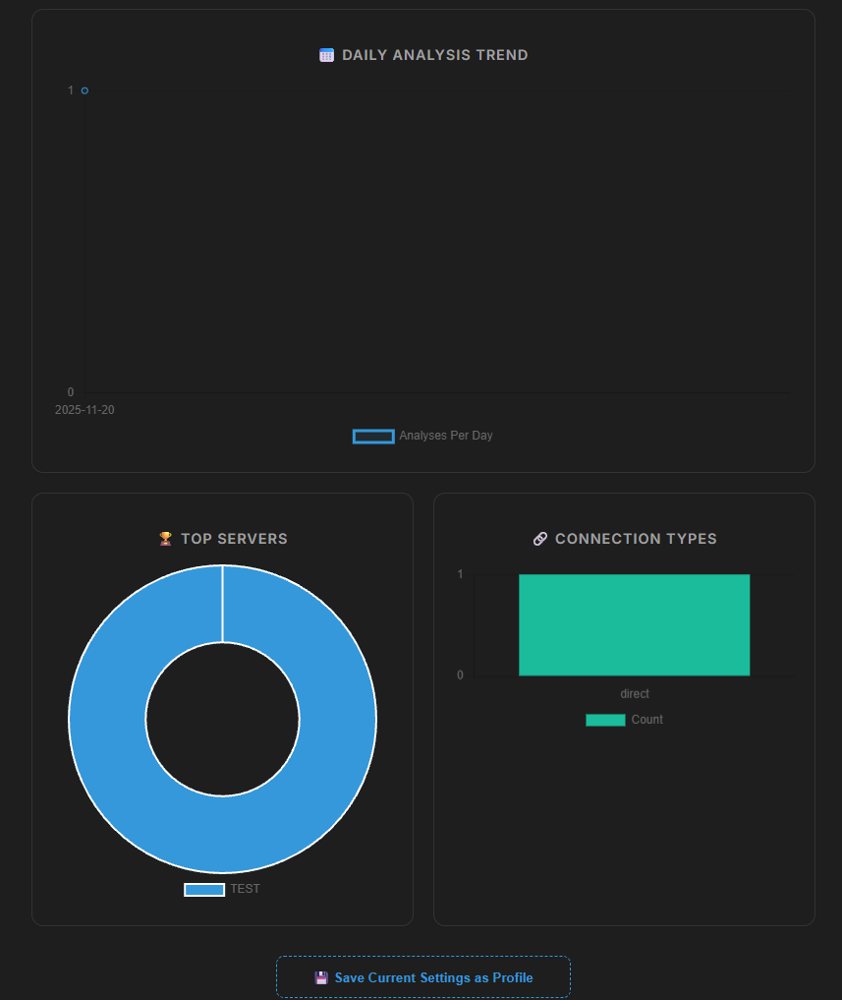
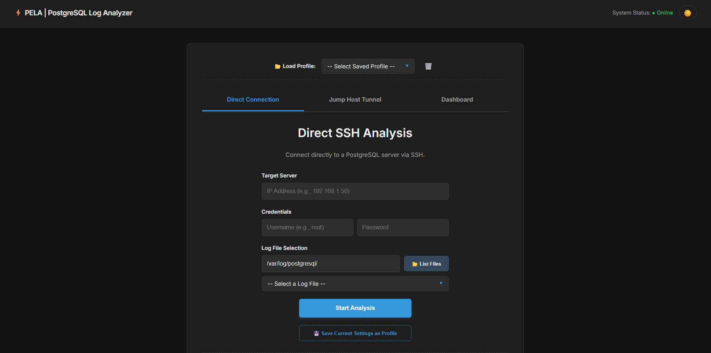
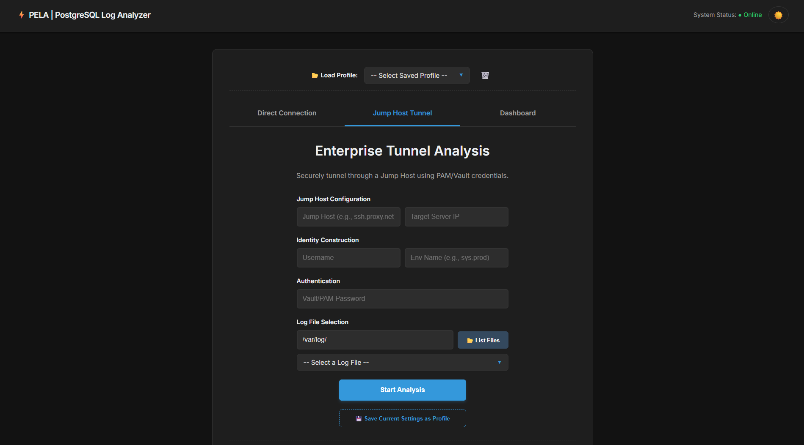
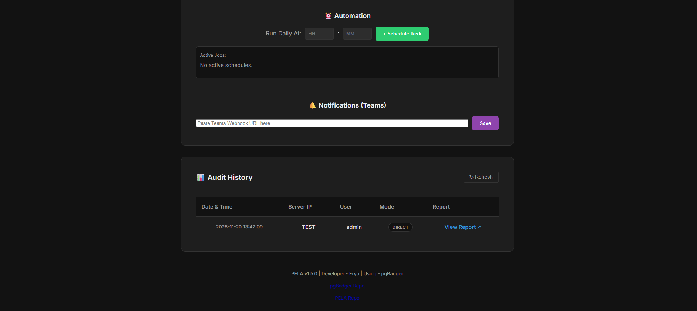

# PELA - PostgreSQL Enterprise Log Analyzer 🚀


**PELA** is a lightweight, enterprise-grade observability tool designed for DBAs and DevOps engineers. It automates the retrieval and analysis of PostgreSQL logs, supporting complex network architectures (Jump Hosts/Bastion) and generating visual reports using the powerful **pgBadger** engine.

It goes beyond simple scripting by providing an **Operational Dashboard**, **Audit Trails**, **Automated Scheduling**, and **Real-time Notifications**.

---

## ✨ Key Features

* **🔐 Enterprise Connectivity:**
    * **Direct SSH:** Connect directly to accessible database servers.
    * **Jump Host Tunneling:** Securely tunnel through Bastion servers (supports complex PAM/Vault username structures like `user@user#env@ip@jump`).
* **📂 Smart Log Discovery:** No need to remember file paths. PELA lists remote log files for you to select.
* **📊 Visual Dashboard:** Interactive charts (Chart.js) to visualize most analyzed servers, daily activity trends, and connection types.
* **🤖 Automation & Scheduling:** Schedule daily analysis tasks to run automatically in the background using `APScheduler`.
* **🔔 Proactive Alerts:** Get instant notifications via **Microsoft Teams** Webhooks when an analysis completes or fails.
* **📜 Audit Trail:** Automatically logs every operation to a local SQLite database for historical tracking.
* **🎨 Modern UI:** Features a clean, tabbed interface with a toggleable **Dark Mode**.
* **🐳 Docker Ready:** Fully containerized for easy deployment anywhere.

---

## 📸 Screenshots

| **Operational Dashboard** | **Dark Mode UI** |
|:-------------------------:|:----------------:|
|  |  |

| **Connection Manager** | **Audit History** |
|:----------------------:|:-----------------:|
|  |  |

*(Note: Please add screenshots to `docs/images/` folder)*

---

## 🛠️ Tech Stack

* **Backend:** Python, Flask, Paramiko (SSH), APScheduler, SQLite
* **Frontend:** HTML5, CSS3 (Variables), JavaScript (Vanilla), Chart.js
* **Engine:** Perl, pgBadger (Embedded)
* **Infrastructure:** Docker, Docker Compose

---

## ⚙️ Prerequisites

Before running PELA locally, ensure you have:

1.  **Python 3.9+** installed.
2.  **Perl** installed (Crucial for pgBadger execution).
    * *Windows:* [Strawberry Perl](https://strawberryperl.com/)
    * *Linux:* `sudo apt install perl`
3.  **(Optional)** Docker Desktop if you prefer containerized usage.

---

## 📥 Installation & Usage

### Option A: Local Python Setup

1.  **Clone the repository:**
    ```bash
    git clone [https://github.com/YOUR_USERNAME/pela.git](https://github.com/YOUR_USERNAME/pela.git)
    cd pela
    ```

2.  **Create and activate a virtual environment:**
    ```bash
    python -m venv venv
    # Windows:
    .\venv\Scripts\activate
    # Linux/macOS:
    source venv/bin/activate
    ```

3.  **Install dependencies:**
    ```bash
    pip install -r requirements.txt
    ```

4.  **Run the application:**
    ```bash
    python app.py
    ```
    Access the app at: `http://127.0.0.1:5000`

---

### Option B: Docker Deployment (Recommended)

1.  **Build and Run:**
    ```bash
    docker-compose up --build -d
    ```

2.  **Access:**
    Open your browser and go to `http://localhost:5000`.

    *Note: The Docker image includes Perl and all necessary dependencies automatically.*

---

## 🧪 Simulation Mode (Pro Tip)

Want to test the dashboard, reporting engine, or scheduler without connecting to a real server? PELA includes a built-in **Mock Engine**.

1.  Go to the **Direct Connection** tab.
2.  Enter `TEST` in the **Target Server** field.
3.  Fill other fields with random data (e.g., User: `admin`, Pass: `123`).
4.  Click **Start Analysis** OR **Schedule** for 1 minute later.

> The system will generate a realistic **Mock HTML Report** with sample data (Cache Hit Ratios, Slow Queries) and log the activity to the Audit Trail.

---

## 🔔 Microsoft Teams Integration

To receive notifications:

1.  Create an **Incoming Webhook** in your Microsoft Teams channel.
2.  Copy the Webhook URL.
3.  In PELA, go to the **Notifications** section (bottom of the page).
4.  Paste the URL and click **Save**.

---

## 🤝 Contributing

Contributions are welcome! Please read [CONTRIBUTING.md](CONTRIBUTING.md) for details on our code of conduct and the process for submitting pull requests.

---

## 📄 License

This project is licensed under the MIT License - see the [LICENSE](LICENSE) file for details.

---

## 🙏 Acknowledgments

* Special thanks to [Gilles Darold](https://github.com/darold) for creating **pgBadger**, the powerful core analysis engine used in this project.

---
*Engineered by [Eren Yormaz](https://github.com/eryo-dev)*